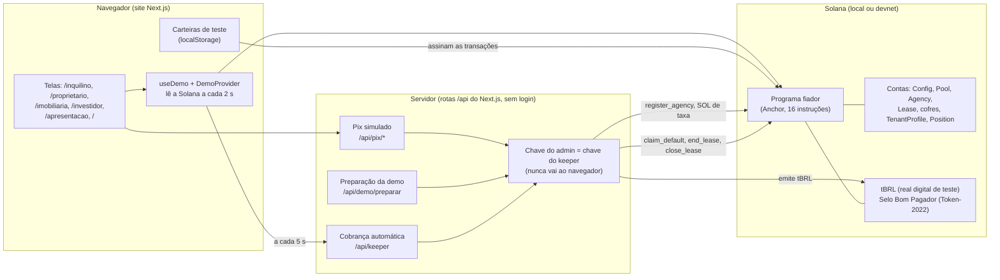
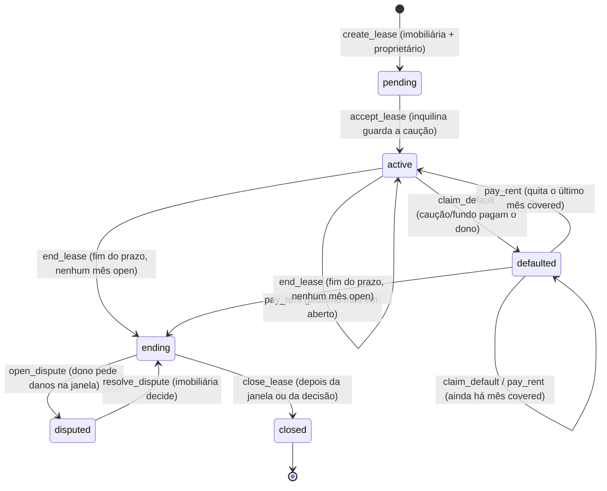
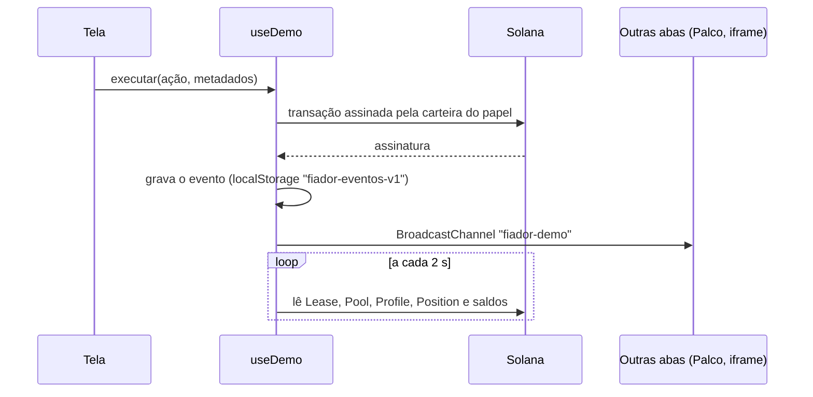

# Arquitetura do Fiador.sol

Atualizado em 2026-09-28. Descreve o software **como ele existe hoje** no repositório, inclusive o que ainda não está protegido (seção 9). Quando este texto e o código divergirem, vale o código, e a divergência vai para [04-BUGS.md](04-BUGS.md).

## 1. Em uma frase

A inquilina guarda a caução por Pix num **cofre do contrato na Solana**. As regras do programa pagam o proprietário todo mês, usam a caução (e depois o fundo de garantia) se o aluguel atrasar, e devolvem a caução com rendimento no fim. Cada mês pago em dia vira reputação da inquilina.

## 2. Visão geral

São três camadas:

1. **Programa na Solana** (`programs/fiador/`): guarda o dinheiro e aplica as regras. É a única camada que mexe em valores. Não depende do site.
2. **Servidor** (`web/src/app/api/`): faz o que precisa da chave do administrador. Credencia a imobiliária, emite o real digital de teste quando o Pix simulado é "pago" e roda a cobrança automática (keeper). **Nenhuma rota exige login** (ver seção 9).
3. **Site** (`web/src/app/`): as telas de cada pessoa. Cada transação é assinada no navegador pela carteira de teste do papel correspondente.

## 3. Programa na Solana (`programs/fiador/`)

- **Tecnologia:** Anchor 1.2 (Rust), Solana CLI 4.2 (Anza). Endereço do programa: `AxA7odS9fftDNCmx8QaqYiiU79mNEemTcper2VWswjp4` (desde 28/09; o anterior, `C6wu…`, foi perdido com a chave, ver B-023). Cópia da chave em `~/Documents/Fiador-backups/`. A chave fica em `target/deploy/fiador-keypair.json`, fora do git; se perder, o endereço muda.
- **Organização:** `src/lib.rs` (lista das 16 instruções), `src/instructions/` (uma instrução por arquivo; as do fundo ficam em `pool_ops.rs`), `src/state/` (formato das contas), `src/errors.rs` (mensagens de erro em português), `src/utils.rs` (transferência de tokens).
- **Testes:** `programs/fiador/tests/test_lease.rs`, 55 testes com LiteSVM 0.16 e relógio simulado, incluindo as regressões das brechas corrigidas em 28/09 e um teste de invariantes com eventos aleatórios. Rodar com `cargo test`. As brechas ainda abertas da seção 9 **não** estão na suíte. Algumas têm prova de conceito em `Fiador Doc/provas/` (11 testes que passam hoje, confirmando a brecha), para colar na suíte e inverter depois da correção.

### 3.1 Contas (onde os dados ficam)

| Conta | Endereço derivado (sementes) | O que guarda |
|---|---|---|
| `Config` | `["config"]` | Regras globais: admin, mint do tBRL, modo demo, período mínimo, carência, taxa de garantia (bps), rendimento (bps), meses de cobertura, teto de cobertura, períodos de espera do fundo, limite por imobiliária (bps), aviso prévio de saque, janela de danos, mint do selo. **Não há instrução para alterá-la depois do `initialize`**, nem para trocar o admin. |
| `Pool` | `["pool"]` | Fundo de garantia: total de cotas, total de ativos (contábil, não o saldo do cofre), cobertura reservada, taxas recebidas. |
| Cofre do pool | `["pool_vault"]` | Conta de tokens do fundo. Autoridade: PDA `pool`. |
| Reserva de rendimento | `["yield_reserve"]` | Conta de tokens que paga o rendimento simulado da caução. Autoridade: PDA `config`. |
| `Agency` | `["agency", carteira]` | Imobiliária credenciada: ativa ou não, cobertura do fundo em uso. **Nenhuma instrução muda `active` para falso.** |
| `Lease` | `["lease", proprietário, inquilino, id]` | O contrato: partes, impressão digital do PDF, aluguel, duração de cada período, nº de períodos, cópia das regras da Config no momento da criação, status, estado de cada mês (`open`, `paid`, `covered`, `settled`), saldos da caução e dívidas, contadores de pagamento, dados de danos. |
| Cofre do contrato | `["vault", lease]` | Conta de tokens onde fica a caução. Autoridade: PDA `lease`. |
| `TenantProfile` | `["profile", inquilino]` | Reputação: pagos em dia, com atraso, calotes, contratos iniciados (aceitos) e concluídos (fechados). |
| `Position` | `["position", investidor]` | Cotas do investidor no fundo e pedido de saque pendente (quantidade e data do pedido). |

### 3.2 Regras principais (valores da demonstração em `web/scripts/setup-demo.ts`)

| Regra | Produção (plano) | Demonstração |
|---|---|---|
| Duração de um "mês" | mínimo 28 dias | 60 s (a imobiliária escolhe 60, 90 ou 120 s) |
| Carência | 5 dias | 20 s |
| Taxa de garantia | 8% de cada aluguel, vai ao fundo e não volta | igual |
| Caução | 3, 2 ou 1 aluguel, conforme a reputação | igual |
| Fundo cobre | depois de 2 aluguéis pagos no contrato (em dia **ou atrasados**; quitações contam). A cobertura **cresce ¼ de aluguel a cada aluguel pago** (`coverage_growth_bps` = 2500) até 3 aluguéis e no máximo R$ 15.000 por contrato, e o fundo paga **80%** do que faltar (franquia de 20% do proprietário, `landlord_deductible_bps` = 2000). O resto vira `landlord_debt`. Desde 28/09 | igual |
| Aluguel e duração do "mês" | aluguel ≥ `min_rent_amount`; mês entre 28 e 35 dias (`max_period_secs` ≤ 35 dias) | aluguel ≥ R$ 100; mês entre 60 e 600 s |
| Limite por imobiliária | a cobertura travada por uma imobiliária não passa de 50% do fundo, **medido no aceite de cada contrato** | igual (`agency_max_pool_bps = 5000`) |
| Janela de danos | 15 dias depois do fim | 30 s |
| Aviso prévio de saque do fundo | 7 dias | 30 s |
| Rendimento da caução | 10% ao ano (simulado, pago pela reserva) | ver a nota abaixo |
| Selos | 3, 6 e 12 pagamentos em dia (Token-2022 intransferível), emitidos no `pay_rent` | igual |

**Caução pela reputação** (`TenantProfile::tier` e `deposit_months`), calculada no `accept_lease`:

| Situação do perfil | Caução |
|---|---|
| `defaults > 0` (qualquer calote registrado) | 3 aluguéis |
| `on_time ≥ 12` **e** `leases_started ≥ 2` | 1 aluguel |
| `on_time ≥ 6` | 2 aluguéis |
| demais casos | 3 aluguéis |

Detalhes que mudam a leitura da regra:
- `on_time` soma os pagamentos em dia de **todos** os contratos; os 12 podem vir de um contrato só.
- `leases_started` conta contratos **aceitos**, não concluídos. O contrato atual entra na conta só depois do aceite.
- `defaults` só aumenta no `close_lease` (seção 3.4). Um atraso cobrado num contrato ainda aberto não muda a caução do próximo.
- O limite de 50% usa o `total_assets` do fundo no momento do aceite. Se o fundo encolher depois, a fatia da imobiliária pode passar de 50% sem que nada seja recalculado.

**Nota sobre o rendimento (divergência aberta, B-A20):** o programa calcula `caução devolvida × 10% × (fechamento − início) / 365 dias`, sempre com o ano real. A tela (`rendimento` em `web/src/lib/historia.ts`) usa `caução exigida × 10% × tempo / (12 períodos)`. Na demonstração, com "meses" de 60 s, a tela mostra cerca de 10% de rendimento e a Solana paga praticamente zero.

### 3.3 Ciclo de vida de um contrato

Quem pode chamar cada passagem:

| Instrução | Quem assina | Condição conferida pelo programa |
|---|---|---|
| `initialize` | **qualquer carteira** (a primeira vira admin) | nada liga o admin à autoridade de atualização do programa (B-A21) |
| `create_lease` | imobiliária ativa + proprietário | período ≥ mínimo, 1 a 36 meses, proprietário ≠ inquilina e imobiliária ≠ inquilina. **imobiliária ≠ proprietário** (desde 28/09, B-A25); aluguel ≥ mínimo; mês ≤ máximo |
| `accept_lease` | inquilina | status `pending`, imobiliária ativa, fundo com cobertura livre, limite de 50% |
| `pay_rent` | inquilina | status `active`/`defaulted`; paga o **primeiro** mês `open` ou `covered`, **só se o mês já começou** (desde 28/09, B-A09); na reputação, no máximo 1 pagamento em dia por janela de tempo |
| `claim_default` | qualquer um | primeiro mês `open` vencido além da carência |
| `end_lease` | qualquer um | último vencimento passou e nenhum mês `open` |
| `open_dispute` | proprietário | status `ending`, dentro da janela, valor ≤ caução restante; não reabre depois de decidida (desde 28/09, B-A18) |
| `resolve_dispute` | imobiliária do contrato | status `disputed`, prêmio ≤ pedido e ≤ caução. A inquilina não assina nem responde (B-A25) |
| `close_lease` | qualquer um | status `ending` e (janela vencida ou disputa decidida) |

Depois do `end_lease`, `pay_rent` não é mais aceito: um mês `covered` não pode mais ser quitado.

### 3.4 Para onde vai o dinheiro em cada passo

| Passo | Sai de | Vai para | Observação |
|---|---|---|---|
| `accept_lease` | carteira da inquilina | cofre do contrato | caução; trava `coverage_cap` no fundo e na imobiliária |
| `pay_rent` de mês `open` | carteira da inquilina | proprietário (aluguel) + cofre do pool (8%) | em dia se `agora ≤ vencimento` |
| `claim_default` | cofre do contrato, depois cofre do pool | proprietário | fundo só entra após 2 pagos e até o teto; o que nenhum dos dois cobrir vira `landlord_debt` (desde 28/09, B-A10) |
| `pay_rent` de mês `covered` | carteira da inquilina | primeiro o proprietário (`landlord_debt`), depois o cofre do pool (dívida com o fundo + 8%), o resto ao cofre do contrato | o proprietário nunca recebe duas vezes pelo mesmo mês |
| `resolve_dispute` | cofre do contrato | proprietário | só alcança caução que sobrou; o fundo não perde prioridade (invariante I7, abaixo) |
| `close_lease` | cofre do contrato; reserva de rendimento | inquilina (sobra + rendimento) | destrava a cobertura não usada. O código tem um passo "caução restante repõe o fundo", mas ele **nunca movimenta dinheiro** (B-017). A dívida que sobra com o fundo fica registrada no `Lease` e ninguém a cobra (B-A24) |

**Invariante I7 (conferido pelo conselho):** se o contrato deve ao fundo, a caução está zerada. O `claim_default` usa toda a caução antes do fundo, e a quitação repõe o fundo antes da caução. É por isso que a disputa de danos não passa na frente do fundo (B-A11 foi refutada: B-016). Os outros invariantes estão em [06-CONSELHO-SEGURANCA.md](06-CONSELHO-SEGURANCA.md), seção 6.

**O que conta como calote:** no `close_lease`, se algum mês ainda está `covered` (foi pago pela caução ou pelo fundo e nunca quitado), `profile.defaults` aumenta em 1. Isso vale mesmo quando o mês foi pago só pela caução, sem prejuízo ao fundo, e o calote nunca expira (B-A16). Como o perfil é por carteira, uma carteira nova começa sem calote (B-A13, B-A24).

## 4. Servidor (`web/src/app/api/` e `web/src/lib/server.ts`)

| Rota | O que faz | Proteção hoje |
|---|---|---|
| `GET /api/estado` | Informa rede, programa, mint do tBRL e mint do selo (lidos de `web/.demo.json`). | pública, só leitura |
| `POST /api/demo/preparar` | Recebe 4 carteiras no corpo. Dá SOL de taxa às que têm menos de 0,05 SOL (airdrop na rede local; **transferência do admin na devnet**), credencia a carteira "imobiliária" com `register_agency` e cria a conta de tBRL do proprietário. Pode ser repetida (idempotente). | **nenhuma**: qualquer carteira vira imobiliária credenciada (B-A08) |
| `POST /api/pix/cobranca` | Cria uma cobrança Pix simulada (até R$ 200.000, código "copia e cola" sem validade real), guardada na memória do processo. | nenhuma |
| `POST /api/pix/confirmar` | "Já paguei": o admin emite tBRL na carteira da cobrança. Limite de R$ 500.000 por hora por carteira, contado na memória. | limite contornável com carteira nova; duas chamadas simultâneas emitem duas vezes (B-A19) |
| `POST /api/keeper` | Cobrança automática: percorre todos os contratos e chama `claim_default` (mês vencido além da carência), `end_lease` (fim do prazo) e `close_lease` (fim da janela de danos), criando antes as contas de tBRL que faltarem. Cada aba aberta do site chama a rota a cada 5 s. | nenhuma; as ações são permitidas a qualquer um, mas as taxas saem da carteira do admin (B-A15) |

A chave do admin vem de `ADMIN_SECRET_KEY` (hospedagem) ou do arquivo do Solana CLI (`~/.config/solana/id.json`). Ela **só existe no servidor**, mas é **a mesma chave** para tudo:

| Poder da chave do admin | Onde é usado |
|---|---|
| **Atualizar o programa** (é a carteira do `anchor deploy`; quem a tiver troca o código e leva todos os cofres) | `Anchor.toml:14` (B-A22) |
| Emitir tBRL sem limite (autoridade de emissão do mint) | `/api/pix/confirmar`, `setup-demo.ts` |
| Credenciar imobiliárias (`register_agency`) | `/api/demo/preparar` |
| Definir o mint do selo (`set_badge_mint`) | `setup-demo.ts` |
| Pagar as taxas e contas criadas pelo keeper | `/api/keeper` |
| Pagar SOL de taxa às carteiras de teste (devnet) | `/api/demo/preparar` |

As ações do keeper não precisam de nenhum poder especial no programa (D-04). O risco está em a chave que as assina ser a mesma que emite dinheiro e credencia imobiliárias, e em as rotas que a usam estarem abertas.

## 5. Site (`web/src/`)

### 5.1 Pastas

| Pasta | Conteúdo |
|---|---|
| `app/` | Uma pasta por área (rotas do Next.js App Router). Cada área tem `layout.tsx` com o `DemoProvider`. |
| `app/<área>/dados.ts` | Hook que calcula o que as telas da área mostram (`useInquilino`, `useProprietario`, `useInvestidor`). |
| `components/useDemo.ts` | Coração do estado: carteiras de teste, leitura da Solana a cada 2 s, eventos, cobrança automática a cada 5 s e `executar()` para mandar transações. |
| `components/DemoProvider.tsx` | Compartilha o `useDemo` entre as telas de uma área (`useD`) e oferece o relógio de 1 s (`useTick`). |
| `components/PixFluxo.tsx` | Tela de Pix no padrão dos bancos (valor, validade, copiar código, QR recolhido, "Simular: já paguei"). |
| `lib/actions.ts` | Monta e envia cada instrução do programa, assinada pela carteira certa. No `payRent`, cria antes as contas de tBRL do proprietário e do selo da inquilina (o programa exige a conta do selo em todo pagamento depois que o selo é definido). |
| `lib/historia.ts` | Traduz o contrato da Solana para a história (Ana, Carlos, meses de agosto em diante, cartela, rendimento, momento atual). Repete regras do programa (`mesesDeCaucao`) e tem sua própria conta de rendimento (ver 3.2). |
| `lib/pdas.ts`, `lib/program.ts`, `lib/constants.ts`, `lib/format.ts` | Endereços derivados, cliente Anchor, constantes (rede, explorador) e formatação de valores. |
| `ui/` | Componentes visuais do design "Recibo" com cara de banco (`index.tsx` + `ui.module.css`). |
| `idl/` | Descrição do programa gerada pelo Anchor. **Recopiar depois de mudar o programa.** |

### 5.2 Telas por pessoa

| Rota | Pessoa | Formato |
|---|---|---|
| `/` | Público | Página inicial, com o app da Ana ao vivo num celular. |
| `/apresentacao` | Banca | Palco: celular com `/inquilino` num iframe, registros da Solana, linha da imobiliária, 5 etapas e o botão "Avançar". |
| `/inquilino/*` | Ana (inquilina) | Celular: início, aceitar convite, pagar, extrato (sua conta e cofre), comprovante, caução, selos, conta. |
| `/proprietario/*` | Carlos (proprietário) | Celular: início, extrato, comprovante, contrato e informe de IR, danos, conta. |
| `/imobiliaria/*` | Imobiliária Sol | Computador: carteira, novo contrato, contrato da Ana (com decisão de danos). |
| `/investidor/*` | Rafael (investidor) | Computador e celular: posição, aportar, resgatar, documentos. |
| `/reputacao/[carteira]` | Público | Histórico de uma carteira na Solana, com selos e caução sugerida. |
| `/demo` | Equipe | Console técnico antigo (depuração). |

### 5.3 Como o estado circula

- **Fonte da verdade:** a Solana. Os eventos guardados no navegador só servem para montar extratos e comprovantes (data e assinatura).
- **Carteiras de teste:** 4 chaves (imobiliária, proprietário, inquilina, investidor) geradas no navegador e guardadas no localStorage (`fiador-demo-v1`). Todas as abas do mesmo navegador usam as mesmas. Consequência: cada visitante controla, ao mesmo tempo, uma imobiliária credenciada, um proprietário e uma inquilina, que é exatamente o conluio que o item 1 do `docs/SEGURANCA.md` quer impedir. Na rede local isso é aceitável; na devnet, ver B-A08.
- **Preparação:** a cada sessão, o site chama `/api/demo/preparar` uma vez. Isso resolve o caso em que a rede de teste foi reiniciada.

## 6. Fluxos principais

1. **Criar contrato:** `/imobiliaria/novo` → `createLease` (assinam a imobiliária e o proprietário) → o contrato fica `pending`.
2. **Caução:** `/inquilino/aceitar` → Pix simulado (emite tBRL) → `acceptLease` (o site cria o perfil antes, se preciso, com `initProfile`; o programa guarda a caução no cofre e trava a cobertura) → `active`.
3. **Aluguel:** `/inquilino/pagar` → revisar → Pix → `payRent` (aluguel ao proprietário, taxa ao fundo; selo aos 3, 6 e 12 em dia) → comprovante.
4. **Atraso:** passada a carência, o keeper chama `claimDefault`: a caução paga o proprietário (e o fundo, depois de 2 aluguéis pagos) → mês `covered`.
5. **Quitação:** `payRent` num mês `covered` repõe o fundo primeiro, depois a caução → mês `settled`, que conta como atraso, não como calote. Só é possível **antes** do `endLease`.
6. **Fim:** keeper chama `endLease` assim que o prazo acaba e não há mês `open` → janela de danos → o proprietário pode `openDispute` → a imobiliária `resolveDispute` → o keeper chama `closeLease` (a caução repõe o fundo, a sobra volta com rendimento; reputação atualizada).
7. **Fundo:** `/investidor/aportar` → Pix → `poolDeposit` (cotas pelo valor contábil); `/investidor/resgatar` → `requestWithdraw` → aviso prévio → `poolWithdraw` (só da parte livre). O pedido de saque não expira (B-A12).

## 7. Ambientes

| Ambiente | Como rodar |
|---|---|
| Local (padrão) | `./scripts/demo-local.sh` liga a Solana local com o programa, roda `npm --prefix web run setup` (gera `web/.demo.json`) e abre o site em `http://localhost:3000`. |
| Devnet | Pendente: publicar o programa na devnet (precisa de SOL de faucet) e configurar `NEXT_PUBLIC_RPC_URL`, `NEXT_PUBLIC_CLUSTER=devnet` e `ADMIN_SECRET_KEY`. **Antes de publicar**, resolver no mínimo B-A21 (`initialize` sem dono), B-A22 (chave única), B-A36 (`.env` no `.gitignore`), B-A08, B-A15, B-A19, B-A26, B-A33, B-A34 e B-A35. Na devnet o site fica aberto a qualquer pessoa: essas falhas permitem tomar o programa, gastar o SOL do admin, credenciar imobiliárias e travar o fundo. |

Variáveis: `NEXT_PUBLIC_RPC_URL` (padrão `http://127.0.0.1:8899`), `NEXT_PUBLIC_CLUSTER` (`localnet` ou `devnet`), `ADMIN_SECRET_KEY` ou `ADMIN_KEYPAIR`.

## 8. Segurança (resumo; detalhes em [07-SEGURANCA-SOFTWARE](07-SEGURANCA-SOFTWARE.md), [06-CONSELHO-SEGURANCA](06-CONSELHO-SEGURANCA.md) e, para golpes, [08-RESPOSTA-A-GOLPE](08-RESPOSTA-A-GOLPE.md))

O que o programa garante hoje:

- Só imobiliária credenciada cria contrato; o proprietário também assina. *(Mas qualquer um consegue se credenciar pela rota de preparação: B-A08.)*
- O cofre do contrato é uma conta do programa: nenhuma pessoa tem a chave. Os valores só saem pelas regras.
- Ninguém cobra antes da carência; o mesmo mês não é cobrado duas vezes; o proprietário não recebe duas vezes pelo mesmo mês.
- O fundo não promete cobertura que não tem, e cada imobiliária reserva no máximo 50% dele no momento de cada aceite.
- Saque do fundo com aviso prévio, só da parte livre; quem pediu saque ainda absorve calotes durante o aviso. *(Mas um pedido antigo continua valendo para sempre: B-A12.)*
- Termos copiados para o contrato na criação: mudanças de regra não atingem contratos assinados (e hoje nem existe instrução para mudar a Config).
- Selo intransferível (extensão NonTransferable conferida em `set_badge_mint`), emitido só pelo programa (PDA `config`).

O que depende de pessoas ou de chaves:

- A chave de atualização do programa é da equipe; em produção, o plano é um multisig.
- A chave do admin é uma só para emissão de tBRL, credenciamento, selo e keeper (seção 4). Em produção, o plano é separar em carteiras diferentes (07-SEGURANCA-SOFTWARE, seção 7).
- A imobiliária decide as disputas sem prazo (B-A02), sem ouvir a inquilina (B-A25; a imobiliária já não pode ser a proprietária desde 28/09), e não pode ser descredenciada (B-A14).
- A primeira carteira que chamar `initialize` vira admin para sempre (B-A21).
- O programa não emite eventos: não há como monitorar nem investigar (B-A38).
- As carteiras de teste do navegador não valem nada fora da rede de teste.

## 9. Brechas conhecidas (revisão e conselho de segurança de 2026-09-24)

Encontradas na primeira revisão (B-A08 a B-A20) e pelo conselho de 10 especialistas (B-A21 a B-A41). Nenhuma foi corrigida ainda. As que têm **prova** contam com um teste LiteSVM em `Fiador Doc/provas/` que passa hoje, o que confirma a brecha. Detalhes em [04-BUGS.md](04-BUGS.md). Temas jurídicos, econômicos e de identidade estão em [06-CONSELHO-SEGURANCA.md](06-CONSELHO-SEGURANCA.md).

Gravidade: 🔴 perda de dinheiro ou regra central derrubada · 🟠 alta · 🟡 média · ⚪ baixa. Quando muda entre demo e produção, aparecem as duas.

**Programa na Solana**

| Bug | Gravidade | O problema, em uma linha |
|---|---|---|
| ~~B-A09~~ | ✅ 28/09 (B-019) | Pagar adiantado conta como "em dia" e libera a cobertura do fundo na hora. |
| ~~B-A10~~ | ✅ 28/09 (B-020) | Mês cobrado sem dinheiro: o proprietário fica sem receber, e o pagamento posterior volta para a inquilina. |
| B-A12 | 🔴 · prova | Pedido de saque não expira: o investidor sai antes do calote. |
| B-A21 | 🔴 devnet/produção | `initialize` sem dono: quem chamar primeiro vira admin para sempre. |
| B-A23 | 🟠 · em parte (aluguel mínimo e 1 por janela feitos) | Reputação máxima e 3 selos com aluguel de 1 unidade. |
| B-A24 | 🔴 produção | Conluio com imobiliária credenciada lucra ~R$ 14.200 por contrato à custa do fundo. |
| ~~B-A26~~ | ✅ 28/09 (B-022) | "Mês" sem máximo: fundo travado para sempre; na demo, qualquer um trava 100% do fundo. |
| B-A28 | ⚪ demo · 🔴 produção | Mint sem validação: extensões do Token-2022 e congelamento travam ou esvaziam cofres. |
| B-A13 | 🟠 | Calote só entra na reputação no fechamento; contratos paralelos com caução mínima. |
| B-A14 | 🟠 · 🔴 produção | Sem pausa, sem descredenciar, sem trocar o admin. |
| B-A16 | 🟠 | Não dá para quitar depois do fim do prazo; usar a caução vira calote eterno. |
| B-A17 | 🟠 | Fundo zerado: divisão por zero e ninguém aporta mais. |
| B-A25 | 🟠 · em parte (imobiliária ≠ proprietário feito) | Imobiliária pode ser a proprietária e julgar a própria disputa; a inquilina não tem voz. |
| B-A27 | 🟠 · 🔴 produção | Sem provisão: o fundo registra a perda tarde, e quem sai antes deixa o prejuízo para os outros. |
| B-A30 | 🟠 | Garantia acaba no prazo, não na entrega das chaves; sem rescisão, cancelamento nem aviso de garantia esgotada. |
| B-A31 | 🟠 | Cobertura travada ignora o prazo restante; contratos curtos pagam por proteção inútil. |
| ~~B-A18~~ | ✅ 28/09 (B-021) | Disputa decidida pode ser reaberta. |
| B-A29 | 🟡 | Selo trocável e congelável trava pagamentos. |
| B-A38 | 🟡 · 🟠 produção | Nenhum evento on-chain. |

**Servidor, chaves e operação**

| Bug | Gravidade | O problema, em uma linha |
|---|---|---|
| B-A08 | 🔴 | Qualquer pessoa vira imobiliária credenciada; abrir a página já gasta SOL do admin. |
| B-A22 | 🔴 devnet/produção | Uma chave só é autoridade de atualização, admin, emissora do tBRL e keeper. |
| B-A15 | 🟠 · 🔴 devnet | Keeper aberto, pago pela chave do admin. |
| B-A32 | 🟠 · 🔴 produção | Keeper depende de visitantes, falha em silêncio e se sobrepõe. |
| B-A33 | 🟠 devnet | Rotas chamáveis por qualquer site; erros crus vazam dados. |
| B-A34 | 🟠 demo | RPC público limita as leituras e congela o Palco. |
| B-A35 | 🟠 devnet | Configuração frágil (`.demo.json`, RPC divergente, binário velho). |
| ~~B-A36~~ | ✅ | Corrigido em 2026-09-27 (B-018): `.env*` e arquivos de chave no `.gitignore`. |
| B-A37 | 🟠 | Código e chaves só no notebook, sem backup nem build verificável. |
| B-A19 | 🟡 | Pix simulado: limite contornável e dois caminhos de emissão dupla. |
| B-A20 | 🟡 · 🟠 produção | A tela mostra um rendimento que o programa não paga. |
| B-A39 | 🟡 · 🟠 produção | "Em dia" pela hora da rede; cobrança Pix solta; ponto flutuante. |
| B-A40 | 🟠 produção | Histórico financeiro público por carteira; o produto promete o contrário. |
| B-A41 | 🟡 | `docs/SEGURANCA.md` afirma controles que não existem. |

Já registrados antes e ligados a esta lista: B-A02 (disputa sem prazo, 🟠) e B-A06 (Pix em memória, 🟠 se hospedado). **B-A11 foi refutada** (ver B-016 e o invariante I7 na seção 3.4).

**Ordem sugerida de correção** (plano completo, com o dono de cada item, em 06-CONSELHO-SEGURANCA, seção 5):

1. B-A37: commit e backup cifrado das chaves (a parte do `.gitignore`, B-A36, foi feita em 2026-09-27).
2. No programa, pouco código e cada item com o teste de `provas/` invertido:
   - ✅ `agency ≠ landlord` (B-A25);
   - ✅ período máximo e vencimento com conta verificada (B-A26);
   - ✅ aluguel mínimo e 1 pagamento em dia por janela de tempo (B-A23, B-A09);
   - ✅ `landlord_debt` (B-A10);
   - ✅ disputa não reabre (B-A18).

   Feitos em 2026-09-28.
3. `DEMO_TOKEN` nas rotas que usam a chave do admin, RPC dedicado e fundo publicado de novo no dia da banca (B-A08, B-A19, B-A33, B-A34).
4. Antes da devnet: `initialize` preso à autoridade de atualização (B-A21), chaves separadas (B-A22), keeper por cron (B-A15, B-A32), configuração por variáveis de ambiente (B-A35).
5. Depois: provisão e saque pelo menor valor da cota (B-A27, B-A12), piso do fundo (B-A17), contadores no perfil (B-A13), pausa (B-A14), eventos (B-A38).
