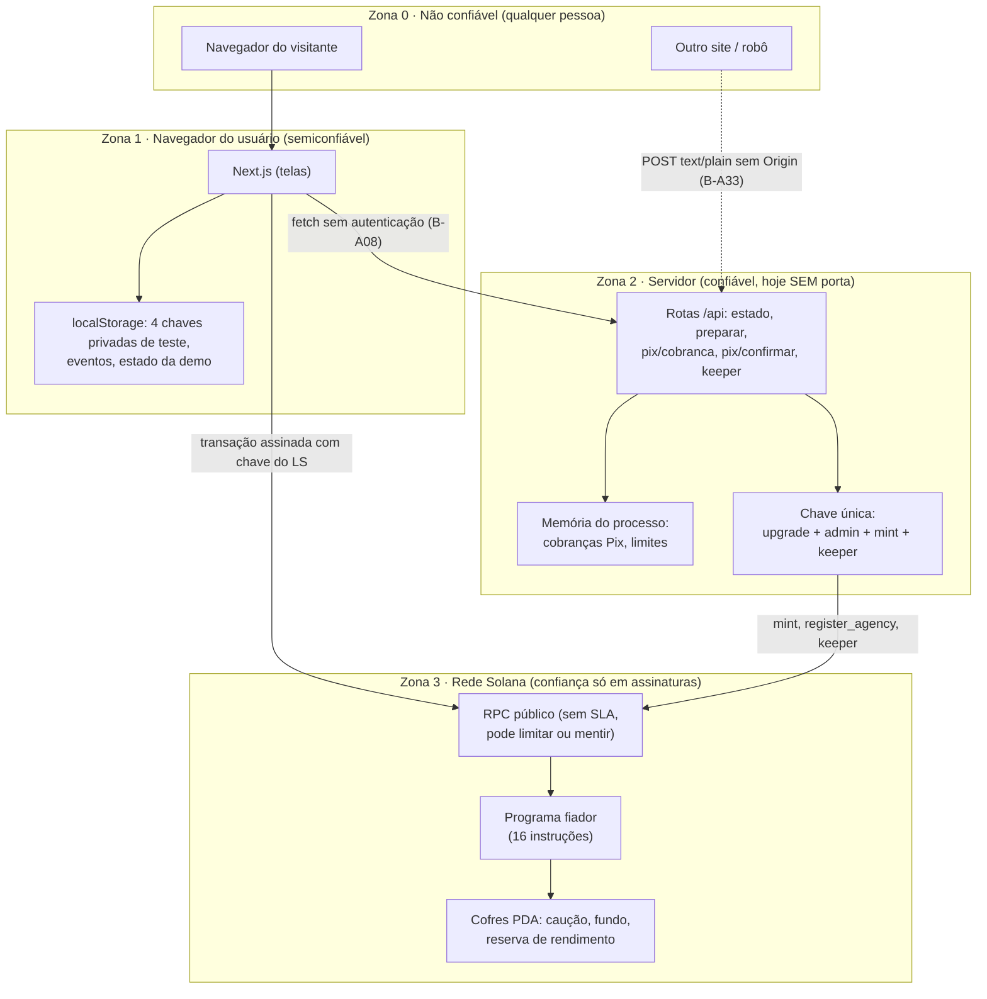
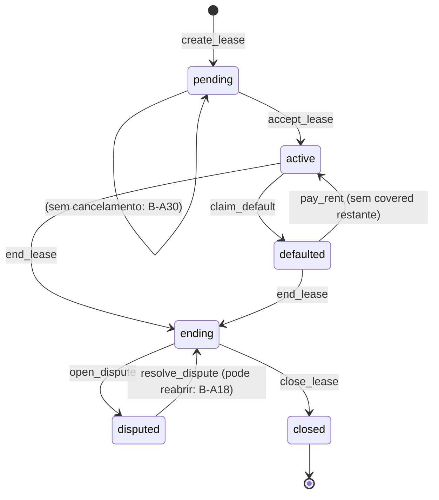
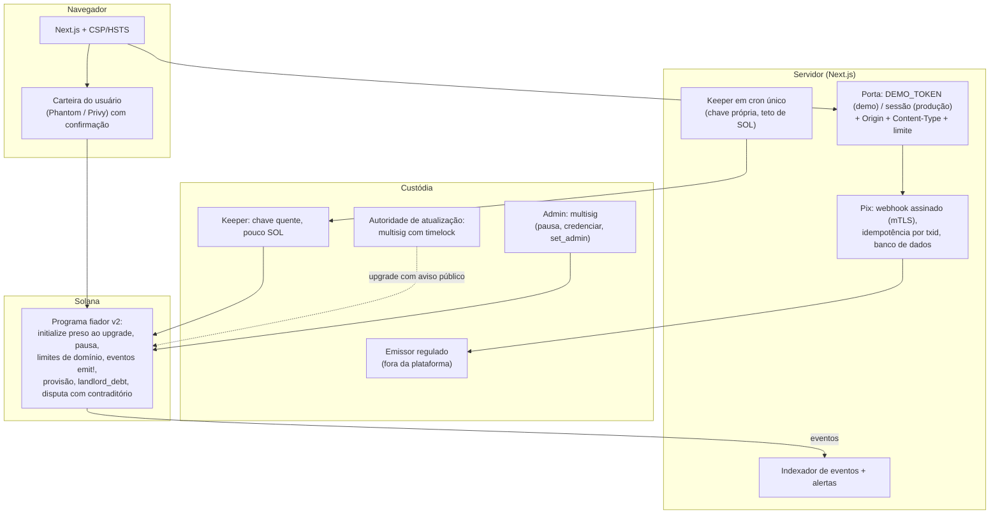

# Arquitetura de software sob a ótica de segurança

Atualizado em 2026-09-24. Este documento olha o Fiador.sol **só como software**: componentes, fronteiras de confiança, quem pode chamar o quê, como cada conta é validada, o que protege cada valor e como deve ficar a arquitetura segura. Os temas jurídicos, econômicos e de negócio estão em [06-CONSELHO-SEGURANCA.md](06-CONSELHO-SEGURANCA.md). Os bugs citados (B-Axx) estão em [04-BUGS.md](04-BUGS.md).

## 1. Verificação feita hoje

| Checagem | Comando | Resultado |
|---|---|---|
| Testes do programa | `cargo test` (cópia limpa do projeto) | **46/46 passam** |
| O binário testado é o código atual? | data de `target/deploy/fiador.so` × `programs/fiador/src/**` | **Sim.** O `.so` (23/09 16:14) é mais novo que todos os arquivos-fonte. Atenção: os testes carregam esse `.so` pronto, não recompilam. Se alguém mudar o código e esquecer o `anchor build`, os testes passam contra o binário velho (ver B-A35). |
| Análise estática do Rust | `cargo clippy -p fiador` | **Sem avisos** |
| Tipos do site | `npx tsc --noEmit` em `web/` | **Sem erros** |
| Dependências do site | `npm audit --omit=dev` | **12 falhas conhecidas: 5 altas, 7 médias.** Todas em pacotes que vêm junto com as bibliotecas da Solana (seção 8) |
| Segredos no código | busca por chaves em formato de array, `PRIVATE KEY`, `secretKey` | **Nenhum** fora de `node_modules`/`target` |
| Segredos no histórico do git | `git log -p` | **Nenhum** (só 1 commit, com 4 arquivos) |
| Arquivos `.env` | `find` | Nenhum existe hoje; desde 2026-09-27 o `.gitignore` os bloqueia (B-018, antes B-A36) |
| `web/.demo.json` | leitura das chaves | Só endereços públicos (`rpc`, `programId`, `admin`, `mint`, `badgeMint`) |
| Cabeçalhos de segurança HTTP | `web/next.config.ts` | **Nenhum** configurado (CSP, `frame-ancestors`, HSTS) |
| Provas de conceito do conselho | `Fiador Doc/provas/` | 11 testes que passam hoje, o que confirma as brechas B-A09, B-A10, B-A12, B-A18, B-A23 e B-A26 |

**O que ainda não foi verificado:**
- teste aleatório (fuzzing) do programa;
- `cargo audit` das dependências do Rust (a ferramenta não está instalada);
- build verificável (`solana-verify`);
- teste de invasão contra o site rodando (a regra do conselho foi não subir servidor).

## 2. Componentes e fronteiras de confiança

| Fronteira | Hoje | Deveria ser |
|---|---|---|
| Visitante → servidor | **aberta**: qualquer origem chama qualquer rota | token de demo ou sessão, checagem de `Origin` e `Content-Type` (B-A08, B-A33) |
| Navegador → chave do usuário | chave privada em texto no `localStorage`, assinatura sem confirmação | carteira de verdade (Phantom) ou embutida (Privy/Web3Auth) com tela de confirmação |
| Servidor → chaves | uma chave faz tudo e pode atualizar o programa | quatro chaves, e a de atualização nunca na hospedagem (B-A22) |
| Servidor/navegador → RPC | RPC público, sem conferência | RPC dedicado; leituras agrupadas; nunca confiar em dado do RPC para decidir dinheiro fora da cadeia sem `finalized` |
| Qualquer um → programa | o programa confere assinaturas, sementes e estado (seção 3) | + `initialize` preso à autoridade de atualização (B-A21), limites de domínio (B-A23, B-A26) |

## 3. Matriz de controle de acesso por instrução

Legenda: ✅ checado · ⚠️ checado, mas com lacuna · ❌ não checado.

| Instrução | Quem assina | Contas-chave e como são validadas | Estado exigido | Dinheiro movido | Lacunas |
|---|---|---|---|---|---|
| `initialize` | admin (**qualquer um**) | `config`, `pool`, cofres criados por PDA ✅; `mint` só confere o programa de token ⚠️ | uma vez só | admin → cofre do fundo | ❌ admin não é a autoridade de atualização (B-A21); ⚠️ mint sem checar extensões nem congelamento (B-A28) |
| `register_agency` | admin | `config has_one admin` ✅; `agency` init por PDA ✅ | — | — | ❌ não existe instrução para desativar (B-A14) |
| `set_badge_mint` | admin | `has_one admin` ✅; mint com autoridade = `config`, 0 casas, NonTransferable ✅ | **qualquer momento** ⚠️ | — | ⚠️ pode ser trocado de novo; não confere congelamento nem delegado permanente (B-A29) |
| `init_profile` | inquilina | PDA com a própria chave ✅ | uma vez por carteira | — | ⚠️ uma carteira nova = perfil limpo (B-A13, B-A24) |
| `create_lease` | imobiliária + proprietário | `agency` por PDA do signatário e `active` ✅; `tenant` sem checagem (`UncheckedAccount`, aceitável) | — | — | ❌ imobiliária pode ser a proprietária (B-A25); ❌ sem máximo de aluguel ou período (B-A23, B-A26) |
| `accept_lease` | inquilina | `lease` por PDA + `has_one tenant` ✅; `agency address = lease.agency` ✅; `profile` por PDA ✅; `tenant_token` com autoridade da inquilina ✅; cofre criado por PDA ✅ | `pending`, imobiliária ativa, cobertura livre, limite de 50% | inquilina → cofre | ⚠️ limite de 50% calculado só no aceite |
| `pay_rent` | inquilina | `lease`/`vault`/`profile`/`pool_vault` por PDA ✅; `landlord_token` com autoridade do proprietário ✅; contas do selo checadas no código ✅ | `active`/`defaulted` | inquilina → proprietário ou cofres | ❌ não confere se o mês já começou (B-A09); ⚠️ mês `covered` não paga o proprietário (B-A10) |
| `claim_default` | **qualquer um** | PDAs ✅; `landlord_token` do proprietário ✅ | 1º mês `open` vencido + carência | cofre e fundo → proprietário | ⚠️ marca `covered` mesmo pagando 0 (B-A10); ⚠️ não mexe no perfil (B-A13) |
| `end_lease` | **qualquer um** | PDA ✅ | último vencimento passou, sem mês `open` | — | ⚠️ encerra no fim do prazo, não na entrega das chaves (B-A30) |
| `open_dispute` | proprietário | `has_one landlord` + PDA ✅ | `ending`, na janela | — | ❌ reabre depois de decidida (B-A18) |
| `resolve_dispute` | imobiliária do contrato | `agency` por PDA do signatário e `address = lease.agency` ✅ | `disputed` | cofre → proprietário | ❌ inquilina não participa; sem prazo (B-A25, B-A02) |
| `close_lease` | **qualquer um** | PDAs ✅; `tenant_token` da inquilina ✅; `yield_reserve` por PDA ✅ | `ending` + janela ou decisão | cofre e reserva → inquilina | ⚠️ rendimento sem limite de tempo (B-A20); dívida com o fundo não é cobrada (B-A24) |
| `open_position` | investidor | PDA com a própria chave ✅ | — | — | ⚠️ sem checagem de sanções (fora do software) |
| `pool_deposit` | investidor | `position has_one owner` ✅; cofre por PDA ✅ | — | investidor → fundo | ❌ divide por zero se o fundo zerar (B-A17); ⚠️ cota não desconta a perda esperada (B-A27) |
| `request_withdraw` | investidor | `has_one owner` ✅ | — | — | ❌ o pedido não expira (B-A12) |
| `pool_withdraw` | investidor | `has_one owner` ✅; saque ≤ parte livre ✅ | aviso prévio cumprido | fundo → investidor | ⚠️ ver B-A12 e B-A27 |

**Pontos fortes confirmados pelo auditor e pelo red team:**
- não existe conta substituível: toda conta que guarda dinheiro é derivada por sementes (PDA) e amarrada ao contrato;
- `has_one` e `address` nas contas de papel (admin, imobiliária, inquilina, dono da posição);
- `transfer_checked` com o mint em toda transferência;
- `overflow-checks = true` no perfil de release (um estouro vira pânico, não dinheiro errado);
- `total_assets` do fundo é contábil (doação direta ao cofre não mexe no preço da cota);
- termos copiados para o contrato na criação;
- selo intransferível conferido por extensão.

## 4. Máquina de estados e invariantes

Invariantes de contabilidade conferidos pelo auditor (valem hoje e devem virar teste automático da suíte):

| # | Invariante | Onde é mantido |
|---|---|---|
| I1 | saldo do cofre do fundo ≥ `pool.total_assets` | `pay_rent`, `claim_default`, `pool_*`, `initialize` |
| I2 | `locked_coverage` = Σ(teto − já pago) dos contratos ativos | `accept_lease`, `claim_default`, `close_lease` |
| I3 | `agency.coverage_in_use` = a mesma soma por imobiliária | idem (usa `saturating_sub`, que **esconde** erro: trocar por `checked_sub`) |
| I4 | saldo do cofre do contrato = `deposit_balance` | `accept_lease`, `pay_rent`, `claim_default`, `resolve_dispute`, `close_lease` |
| I5 | cotas totais = cotas do admin + Σ cotas dos investidores | `pool_deposit`, `pool_withdraw` |
| I6 | cotas com saque pedido ≤ cotas | `request_withdraw` |
| I7 | dívida com o fundo > 0 ⇒ caução = 0 | `claim_default` (usa a caução antes do fundo) e `pay_rent` (repõe o fundo antes da caução) |
| I8 | `total_assets ≥ locked_coverage` | saque limitado à parte livre |

**Regra para qualquer correção futura:** rodar o teste de invariantes antes e depois. As correções de B-A10 (`landlord_debt`) e B-A16 (pagar na janela) mexem justamente no I4 e no I7.

## 5. Servidor: matriz das rotas

| Rota | Chave usada | Autenticação | Validação de entrada | Efeito colateral | Limite | Lacunas |
|---|---|---|---|---|---|---|
| `GET /api/estado` | — | ❌ | — | lê `.demo.json` | — | expõe o `rpc` (vaza a chave de API de um RPC pago) (B-A33) |
| `POST /api/demo/preparar` | admin | ❌ | `new PublicKey` sem esquema | SOL do admin, `register_agency`, conta de token | ❌ | B-A08, B-A33 |
| `POST /api/pix/cobranca` | — | ❌ | carteira válida; valor 0 < v ≤ 200.000 (`number` de ponto flutuante) | grava na memória | ❌ | valor vem do navegador (B-A39) |
| `POST /api/pix/confirmar` | autoridade do mint | ❌ | id existe e não foi pago | **emite tBRL** | R$ 500 mil/h por carteira de destino, na memória | corrida e emissão dupla (B-A19); terceiro bloqueia a Ana (B-A33) |
| `POST /api/keeper` | admin | ❌ | — | taxas e contas criadas pelo admin | ❌ | B-A15, B-A32 |

Comum a todas: `req.json()` aceita `text/plain` de qualquer origem; `errorMessage(e)` devolve o erro cru; não há log estruturado nem alerta.

## 6. Navegador

| Item | Hoje | Risco | Correção |
|---|---|---|---|
| Chaves de teste | 4 chaves privadas no `localStorage` (`fiador-demo-v1`) | um XSS ou extensão maliciosa rouba as quatro | aceitável só com tBRL de teste; em produção, carteira de verdade |
| Assinatura | automática, sem tela de confirmação | clickjacking, transação disfarçada | tela de confirmação traduzida ("R$ X para Carlos") e simulação antes de assinar |
| Cabeçalhos | nenhum | o site pode ser colocado dentro de outro (iframe) | `Content-Security-Policy` com `frame-ancestors 'self'` (o Palco usa iframe do próprio site), `X-Frame-Options: SAMEORIGIN`, HSTS, `Referrer-Policy` |
| Leituras | 10 chamadas ao RPC a cada 2 s por instância; erros engolidos | 429 no RPC e tela congelada (B-A34) | `getMultipleAccountsInfo`, intervalo maior, aviso de falha |
| Regras copiadas | `historia.ts` repete a regra de caução e tem outra fórmula de rendimento | a tela diverge do programa (B-A20) | ler do programa, ou testar as duas fórmulas juntas |
| Página de reputação | lê a Solana direto do navegador | o IP do visitante vai ao RPC (LGPD) | ler pelo servidor (B-A07, B-A40) |

## 7. Chaves e segredos

| Chave | Arquivo/variável hoje | Quem usa | Se vazar | Alvo |
|---|---|---|---|---|
| Autoridade de atualização | `~/.config/solana/id.json` (`Anchor.toml:14`) | `anchor deploy` | **troca o programa e leva tudo** | chave fria fora da hospedagem → multisig com timelock → `--final` |
| Admin (Config) | a mesma | `setup-demo.ts`, `/api/demo/preparar` | credencia imobiliárias falsas | chave própria; `set_admin` em duas etapas |
| Autoridade de emissão do tBRL | a mesma | `/api/pix/confirmar` | emissão sem limite | chave própria com teto; em produção, com o emissor |
| Keeper | a mesma | `/api/keeper` | gasta SOL | chave própria, ≤ 1 SOL |
| Keypair do programa | `target/deploy/fiador-keypair.json` (fora do git, sem backup) | deploy | perde o endereço do programa | backup cifrado offline |
| Chaves dos usuários (demo) | `localStorage` | navegador | só tBRL de teste | carteira de verdade em produção |

## 8. Build, dependências e cadeia de suprimentos

- **Rust:**
  - Anchor 1.2 e toolchain fixada em `rust-toolchain.toml` ✅;
  - `Cargo.lock` presente ✅;
  - `overflow-checks = true` ✅;
  - `cargo audit` nunca rodou ❌.
- **npm:** 12 falhas conhecidas (5 altas), todas vindas de `@solana/web3.js`, `@solana/spl-token` e `@anchor-lang/core`:

  | Pacote | Falha | Risco no Fiador |
  |---|---|---|
  | `bigint-buffer` | estouro de buffer | decodifica dados vindos do RPC; baixo com RPC confiável |
  | `toml` | recursão e *prototype pollution* | só se ler TOML de fora, e o site não lê |
  | `jayson`, `stream-json`, `uuid` | vários | caminho do cliente RPC; baixo |

  O `npm audit fix --force` proposto **quebraria** o projeto (troca de versão principal). O certo é acompanhar as versões novas das bibliotecas da Solana e rodar `npm ci --ignore-scripts` na hospedagem.
- **Pacotes comprometidos no passado:** `@solana/web3.js` está fixado em 1.99.0, fora das versões comprometidas (1.95.6–1.95.7) ✅.
- **Instalação:** `demo-local.sh` usa `npm install` (não `npm ci`) e não recompila o programa se o `.so` já existe (B-A35).
- **Binário publicado:** não há build verificável; não dá para provar que o `.so` publicado vem deste código (B-A37).
- **Automação:** o hook `.claude/hooks/fiador-doc-check.sh` roda ao fim de cada sessão do Claude Code; ele só lê datas de arquivos. É baixo risco, mas vale revisar sempre que for alterado.

## 9. Arquitetura-alvo (como deve ficar)

**Controles por camada** (entre parênteses, o bug que cada um fecha):

| Camada | Controles |
|---|---|
| Programa | `initialize` preso à autoridade de atualização (B-A21); ✅ `agency ≠ landlord` (B-A25); ✅ aluguel mínimo e mês máximo, com conta de vencimento verificada (B-A23, B-A26); 1 pagamento em dia por janela de tempo e espera do fundo por tempo (B-A09); `landlord_debt` (B-A10); disputa com resposta da inquilina, prazo e sem reabrir (B-A02, B-A18, B-A25); pedido de saque com validade e provisão de sinistros (B-A12, B-A27); piso do fundo (B-A17); contadores no perfil (B-A13); pausa, descredenciar e `set_admin` (B-A14); mint validado (B-A28); selo definido uma vez só (B-A29); `emit!` em toda movimentação (B-A38); cobertura crescente e franquia (antifraude, 06 seção 8) |
| Servidor | porta de autenticação em toda rota que usa chave (B-A08, B-A33); keeper em cron (B-A15, B-A32); Pix com estado persistente e idempotente (B-A06, B-A19, B-A39); configuração por variáveis de ambiente, conferida na inicialização (B-A35); erros genéricos |
| Navegador | cabeçalhos de segurança; carteira de verdade; RPC dedicado com leituras agrupadas (B-A34) |
| Chaves | quatro chaves separadas, com multisig para atualização e admin (B-A22); backup cifrado (B-A37) |
| Processo | commit e build verificável (B-A37); teste de invariantes e fuzzing; `cargo audit`/`npm audit` a cada mudança; auditoria externa antes de dinheiro real |

> **Resposta a incidentes e golpes:** o roteiro (conter, preservar provas, investigar, agir, recuperar, aprender) está em [08-RESPOSTA-A-GOLPE.md](08-RESPOSTA-A-GOLPE.md). As peças de software que ele exige são `pause`, `suspend_agency`, a quarentena do pagamento do fundo, os eventos `emit!` e os alertas; estão na linha "Programa" acima.

## 10. Checklist de segurança para cada mudança no software

Colar no fim de cada entrada de 03-ATUALIZACOES quando a mudança tocar programa, rotas ou chaves:

- [ ] `anchor build` rodou e o `.so` é mais novo que o código (os testes carregam o `.so` pronto).
- [ ] `cargo test` inteiro passa, incluindo os testes de regressão das brechas corrigidas.
- [ ] O teste de invariantes I1–I8 passa (quando existir).
- [ ] `cargo clippy` e `npx tsc --noEmit` sem erros.
- [ ] Toda conta nova tem sementes, `has_one`/`address` ou `constraint`; nenhuma conta de dinheiro vem de fora sem amarração.
- [ ] Toda conta nova usa `checked_*`, sem `saturating_*` escondendo erro.
- [ ] Toda instrução nova diz quem assina e em qual estado pode rodar, e entra na matriz da seção 3.
- [ ] Toda rota nova tem porta de autenticação, validação de entrada e erro genérico, e entra na matriz da seção 5.
- [ ] Nenhum segredo em código, `.env` ou log; `.env*` continua no `.gitignore`.
- [ ] `npm audit --omit=dev` e `cargo audit` sem falha **nova**.
- [ ] O IDL foi recopiado para `web/src/idl/`.
- [ ] O Fiador Doc foi atualizado (01, 02, 03, 04 e este arquivo, se a arquitetura mudou).
