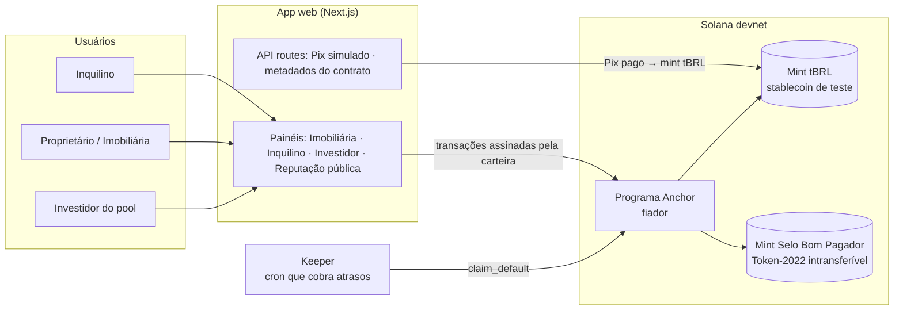
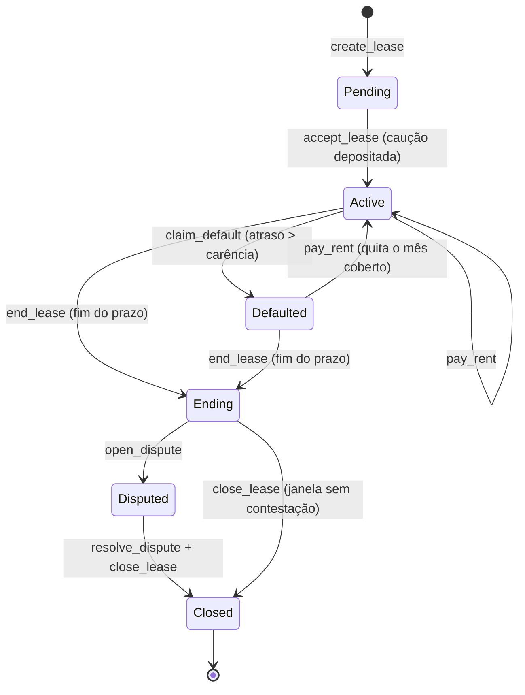

# Arquitetura — Fiador.sol

> ⚠️ **Plano original, escrito antes do código.** O que existe de fato está em `Fiador Doc/01-ARQUITETURA.md`. Se os dois divergirem, vale o código e o Fiador Doc.

> Versão 1 · 23/09/2026 · MVP para o Crypto World's Fair (Colosseum) / Superteam Brasil
> Prazo de entrega: **12/10/2026 23h59 PT** (13/10 03h59 Brasília)

## 1. Visão geral



**Três camadas:**

| Camada | Tecnologia | Papel |
|---|---|---|
| On-chain | Rust + Anchor, devnet | Regras do dinheiro: caução, aluguel, atraso, pool, reputação |
| Off-chain | Next.js (API routes) + script keeper | Pix simulado, cobrança automática de atraso, metadados |
| Front | Next.js + Tailwind + Solana wallet adapter + cliente Anchor TS | Painéis de cada perfil e a demo |

**Princípio:** tudo que envolve dinheiro ou reputação fica no programa. O off-chain só dá conveniência (Pix, automação) e nunca tem poder de mover fundos sozinho.

## 2. Moeda e Pix

- **tBRL** — mint SPL próprio na devnet, 6 casas decimais, 1 tBRL = R$ 1. Representa a stablecoin em real que seria usada em produção (ex.: BRZ ou outra stablecoin BRL regulada).
- **Pix simulado** — a API gera um "Pix copia e cola" fictício; ao clicar em "Já paguei", o backend (dono da mint authority) emite tBRL para a carteira do usuário. Na demo, isso mostra a experiência "pago no Pix, vira dinheiro na Solana".
- **Produção:** trocar o simulador por um parceiro de on/off-ramp BRL (a API fica idêntica para o front).

## 3. Programa on-chain `fiador`

### 3.1 Contas (PDAs)

| Conta | Seeds | Campos principais |
|---|---|---|
| `Config` | `["config"]` | admin, mint tBRL, `premium_bps`, `grace_secs`, `apy_bps`, `coverage_months`, `max_coverage_amount`, `coverage_waiting_periods`, `min_period_secs`, `demo_mode`, `withdraw_cooldown_secs`, `dispute_window_secs`, badge mint |
| `Agency` | `["agency", wallet]` | imobiliária credenciada pelo admin, `active`, `coverage_in_use` |
| `Lease` | `["lease", landlord, tenant, lease_id]` | landlord, tenant, agency, `rent_amount`, `deposit_amount`, `period_secs`, `start_ts`, `total_periods`, estado de cada período (`Open`/`Paid`/`Covered`), `late_count`, `covered_amount`, `dispute_amount`, **cópia dos termos da Config**, `contract_hash`, status |
| Cofre da caução | token account PDA `["vault", lease]` | tBRL da caução do contrato |
| `Pool` | `["pool"]` | `total_shares`, `total_assets`, `locked_coverage`, `premiums_earned` |
| Cofre do pool | token account PDA `["pool_vault"]` | tBRL dos investidores |
| `Position` | `["position", staker]` | cotas do investidor, pedido de saque pendente e data |
| `TenantProfile` | `["profile", tenant]` | `on_time`, `late`, `defaults`, `leases_completed`, `tier` |
| Reserva de rendimento | token account PDA `["yield_reserve"]` | tBRL que paga o rendimento simulado |

`period_secs` é configurável por contrato, mas nunca abaixo de `min_period_secs`: em produção 28 dias; **no deploy de demonstração (`demo_mode`) 60 segundos**, e o público vê "um mês" passar ao vivo.

`contract_hash` guarda o SHA-256 do PDF do contrato de locação. Nenhum dado pessoal vai para a blockchain (LGPD): só chaves públicas e o hash.

### 3.2 Instruções

| Instrução | Quem assina | O que faz |
|---|---|---|
| `initialize` | admin | Cria Config, Pool (com depósito inicial permanente do admin), reserva de rendimento e mint do selo; fixa `demo_mode` |
| `register_agency` | admin | Credencia uma imobiliária |
| `create_lease` | imobiliária credenciada + proprietário | Registra termos (copiando os da Config); exige `landlord ≠ tenant`; status `Pending` |
| `accept_lease` | inquilino | Deposita a caução (valor conforme o `tier`); trava a cobertura no pool, falhando se não houver lastro; status `Active` |
| `pay_rent` | inquilino | Período `Open`: aluguel → proprietário, prêmio → pool. Período `Covered`: dinheiro recompõe pool e depois caução. Conta `on_time` ou `late`; emite 1 selo aos 3, 6 e 12 pagamentos em dia |
| `claim_default` | **qualquer um** (keeper) | Só em período `Open` vencido + carência: paga o proprietário com a caução; se faltar, o pool cobre (após `coverage_waiting_periods` pagos, até o teto); período vira `Covered`; status `Defaulted`. Recompor = `pay_rent` do mês coberto |
| `end_lease` | qualquer um (após o último período) | Status `Ending`; abre a janela de contestação |
| `open_dispute` | proprietário (na janela) | Informa valor de dano/pendência; status `Disputed` |
| `resolve_dispute` | imobiliária do contrato | Define quanto da caução vai ao proprietário |
| `close_lease` | qualquer um (após a janela ou a decisão) | Devolve caução + rendimento ao inquilino, menos o decidido; destrava cobertura; atualiza perfil (os selos já saem no `pay_rent`) |
| `init_profile` | inquilino | Cria o perfil de reputação (uma vez por carteira) |
| `set_badge_mint` | admin | Registra o mint do selo; o programa confere que é Token-2022, intransferível, 0 casas e emitido só pelo PDA `config` |
| `open_position` / `pool_deposit` | investidor | Abre a posição e entra no pool por cotas |
| `request_withdraw` / `pool_withdraw` | investidor | Pede saque; saca após o cooldown, nunca liberando cobertura travada |

`claim_default` ser permissionless é deliberado: o programa verifica o relógio (`Clock`) e o estado, então ninguém consegue cobrar antes da hora — o keeper é só quem aperta o botão.

### 3.3 Máquina de estados do contrato



### 3.4 Regras de negócio (valores iniciais, ajustáveis na Config)

| Regra | Valor MVP | Racional |
|---|---|---|
| Caução exigida — tier 0 (sem histórico) | 3 aluguéis | Teto da Lei 8.245, art. 38 |
| Tier 1 (≥ 6 pagamentos em dia, 0 calote) | 2 aluguéis | Reputação reduz custo |
| Tier 2 (≥ 12 pagamentos em dia em ≥ 2 contratos, 0 calote) | 1 aluguel | Idem, sem permitir reputação fabricada |
| Reputação só conta | contratos de imobiliária credenciada com período ≥ `min_period_secs` | Anti-fraude |
| Prêmio para o pool | 8% de cada aluguel | ≈ 1 aluguel/ano, abaixo do seguro-fiança |
| Cobertura do pool | até 3 aluguéis além da caução, teto R$ 15.000, só após 2 aluguéis pagos | Dá tempo ao proprietário sem despejo e barra conluio |
| Saque do pool | aviso prévio de 7 dias (demo: 30 s) | Impede fuga antes de calote |
| Janela de contestação | 15 dias (demo: 30 s) | Danos e contas no fim do contrato |
| Carência | 5 dias (demo: 20 s) | Atraso curto não dispara cobrança |
| Rendimento da caução | 10% a.a. simulado | Referência CDI; pago pela reserva |
| Selo "Bom Pagador" | marcos de 3, 6 e 12 pagamentos em dia | Token-2022 NonTransferable |

### 3.5 Reputação

- **Fonte da verdade:** a conta `TenantProfile`, que só o programa escreve.
- **Vitrine:** o selo Token-2022 com extensão *NonTransferable* aparece na carteira do inquilino e não pode ser vendido nem transferido.
- **Página pública** `/reputacao/<carteira>`: qualquer imobiliária confere o histórico sem pedir documento.

### 3.6 Rendimento

Na devnet não há rendimento real. O programa calcula `caução × apy × tempo` e paga a partir da reserva abastecida pelo admin — **isso é declarado como simulação na demo**.

Em produção, a caução iria para um ativo tokenizado de renda fixa em real. A Lei 8.245 (art. 38 §2) exige poupança para caução em dinheiro, por isso o enquadramento de produção é **cessão fiduciária de cotas** (art. 37, IV): as cotas do cofre são o ativo dado em garantia.

## 4. Off-chain

### 4.1 App web (Next.js, App Router)

| Rota | Perfil | Conteúdo |
|---|---|---|
| `/` | todos | Landing com proposta de valor e botão "Ver demo" |
| `/imobiliaria` | proprietário/imobiliária | Criar contrato, lista de contratos, status, botão "cobrar atraso" |
| `/inquilino` | inquilino | Aceitar contrato, pagar caução e aluguel via Pix simulado, ver rendimento e selos |
| `/investidor` | investidor | Depositar no pool, ver APY de prêmios, cobertura travada |
| `/reputacao/[wallet]` | público | Histórico e selos de um inquilino |
| `/demo` | apresentador | Painel dividido com as três visões e relógio acelerado |

**Carteira:** Phantom/Solflare via wallet adapter no MVP. Pós-hackathon: carteira embutida por login com e-mail (Privy/Web3Auth) para quem nunca usou cripto.

### 4.2 API routes

| Rota | Função |
|---|---|
| `POST /api/pix/cobranca` | Gera Pix fictício (valor, destino) |
| `POST /api/pix/confirmar` | Emite tBRL para a carteira (só devnet) |
| `POST /api/contrato/hash` | Recebe o PDF, devolve SHA-256 (não armazena o arquivo no MVP) |

A chave da mint authority fica em variável de ambiente no servidor, nunca no front.

### 4.3 Keeper

Script Node que a cada N segundos lista contratos `Active`, identifica vencidos e envia `claim_default`. Roda local na demo; em produção vira cron (ex.: Vercel Cron) ou Clockwork-like.

## 5. Estrutura do repositório

```
fiador-sol/
├── Anchor.toml
├── programs/fiador/src/
│   ├── lib.rs
│   ├── state/          # config.rs, lease.rs, pool.rs, profile.rs
│   ├── instructions/   # uma instrução por arquivo
│   ├── errors.rs
│   └── events.rs
├── tests/              # testes TypeScript (anchor test)
├── web/                # Next.js (site da demo) — ver web/README.md
├── scripts/            # demo-local.sh: liga Solana local + setup + site
└── docs/
```

## 6. Segurança

Revisão completa, com ataques e correções, em [SEGURANCA.md](SEGURANCA.md). Resumo técnico:

- Validação de seeds e `has_one` em todas as contas; mint conferida contra a Config.
- Aritmética com `checked_*`; valores em unidades inteiras (sem float).
- Só o programa (PDA) assina saídas dos cofres.
- `claim_default` idempotente por período: não cobra o mesmo mês duas vezes.
- Saque do pool nunca libera cobertura travada.
- Admin e upgrade authority em carteira separada; em produção, multisig (Squads).
- Contas grandes em `Box` (a pilha da Solana tem 4 KB; sem isso o compilador avisa e o programa se comporta mal).
- Testes cobrindo: pagamento em dia, atraso coberto pela caução, atraso coberto pelo pool, cobrança antecipada rejeitada, encerramento com rendimento, promoção de tier.

## 7. Roteiro da demo (≈ 90 s no vídeo)

1. Imobiliária cria contrato de R$ 2.000 (período = 60 s).
2. Inquilino paga a caução via Pix simulado → tBRL entra no cofre, rendimento começa a correr.
3. "Mês 1": paga em dia → proprietário recebe na hora, pool recebe o prêmio, contador de reputação sobe.
4. "Mês 2": não paga → passam 20 s de carência → keeper dispara → **proprietário recebe da caução na tela**, sem juiz.
5. Inquilino paga o mês atrasado (o dinheiro recompõe a caução, não vai de novo ao proprietário); contrato termina; após a janela de contestação de 30 s, a caução volta com rendimento; os selos já apareceram na carteira no 3º e no 6º pagamento em dia.
6. Página pública de reputação mostra o histórico — próximo aluguel exige menos caução.

## 8. Fora do escopo do MVP

On/off-ramp Pix real · KYC · assinatura digital do contrato · carteira embutida · rendimento real · governança do pool · mainnet.

## 9. Estado atual (23/09)

- **Programa:** 16 instruções em Anchor 1.2; **46 testes passando** (`cargo test`, LiteSVM com relógio simulado), sem avisos de pilha.
- **Site (`web/`):** apresentação, demo ao vivo com os quatro papéis, Pix simulado, keeper automático e reputação pública. Testado de ponta a ponta no navegador contra a Solana local e com `web/scripts/e2e.ts`.
- **Selo:** Token-2022 com `NonTransferable` + nome/símbolo (metadata); autoridade de emissão = PDA `config`.
- **Falta:** publicar na devnet (a torneira de SOL de teste está recusando pedidos automáticos).

## 10. Cronograma

| Até | Entrega |
|---|---|
| 26/09 | Ambiente (Solana CLI + Anchor), `initialize`, `create_lease`, `accept_lease` com testes |
| 30/09 | `pay_rent`, `claim_default`, `top_up_deposit`, `close_lease`, pool — todos testados; deploy na devnet |
| 03/10 | Selo Token-2022, perfil e tiers; scripts de setup e seed |
| 07/10 | App web: painéis + Pix simulado + keeper |
| 09/10 | Página `/demo`, polimento visual, README de submissão |
| 11/10 | Vídeos de pitch e técnico gravados; submissão enviada |
| 12/10 | Folga para imprevistos |
